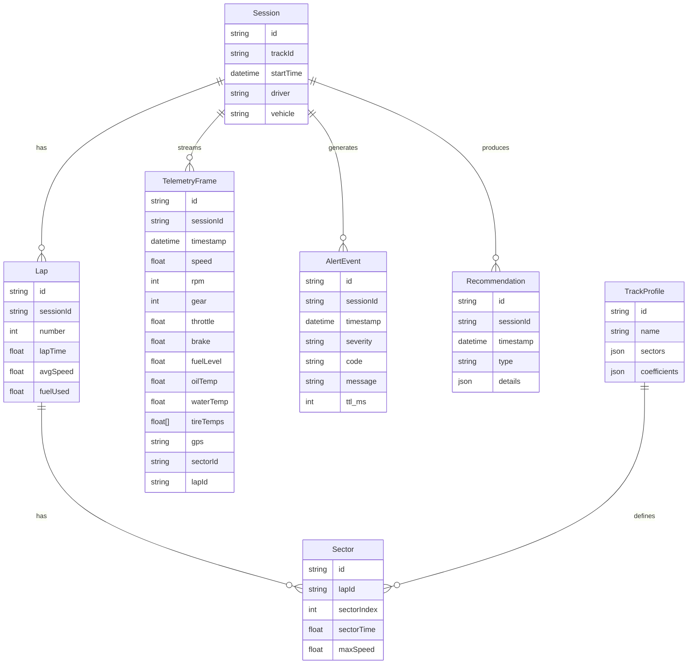

# RaceTelemetryAI — Análisis Integral y Plan de Entrega

Este documento compila el análisis técnico y funcional del proyecto, arquitectura, metodologías, estructura del repositorio, diagramas del sistema, modelado de datos y un plan de acción con cronograma para completar la entrega antes del 20 de noviembre.

## Índice
- 1. Resumen ejecutivo
- 2. Objetivos y alcance
- 3. Requisitos funcionales y no funcionales
- 4. Arquitectura de alto nivel
- 5. Estructura del repositorio
- 6. UI/UX para coche (tablet/móvil/pantalla embarcada)
- 7. Motor de riesgo y recomendaciones (pit window, alertas)
- 8. Datos y entrenamiento de IA (predictivo)
- 9. Integración con hardware y gateway
- 10. Modelado de datos (ER) y contratos de mensajes
- 11. Diagramas del sistema y secuencias
- 12. Metodología de trabajo
- 13. Plan de acción hasta el 20/11
- 14. Riesgos y mitigaciones
- 15. Apéndice: esquemas de mensajes y códigos de alerta

---

## 1. Resumen ejecutivo
RaceTelemetryAI es un dashboard con IA que analiza telemetría de carrera (simulada o real) para ofrecer recomendaciones tácticas y alertas al piloto. La meta: maximizar rendimiento y seguridad, anticipar paradas de pit (pit window) y evitar fallos mecánicos mediante análisis predictivo basado en física y electrónica.

## 2. Objetivos y alcance
- Proveer visualización clara y accionable de datos clave de telemetría.
- Generar recomendaciones de pit en tiempo oportuno basadas en consumo de combustible, degradación y riesgo.
- Alertar con audio y visual (glanceable) priorizando la seguridad del piloto.
- Funcionar en tablets/móviles y pantallas embarcadas conectadas a una red local estable del coche.
- Escalar hacia integración con hardware (CAN/ECU/logger) mediante un gateway.

Fuera de alcance (versión inicial): telemetría en la nube, almacenamiento histórico masivo y analítica pesada en tiempo real en remoto.

## 3. Requisitos funcionales y no funcionales
- Funcionales:
  - Visualizar indicadores de velocidad, RPM, marchas, frenos, temperatura, combustible, tiempos por sector/vuelta.
  - Mostrar alertas con severidad (info/caution/critical) y voz sintetizada.
  - Recomendar pit window considerando consumo por vuelta, vueltas restantes y condiciones.
  - Soportar perfiles de pista (Barber, COTA, VIR, etc.).
  - Fallback para mapas PDF (abrir en nueva pestaña si no se embeben).
- No funcionales:
  - Latencia objetivo extremo a extremo ≤ 50 ms (en red local).
  - Interfaz segura: alto contraste, baja distracción, audio limitado y claro.
  - Resiliencia ante micro-cortes: reconexión y buffer circular en gateway.
  - Seguridad de enlace: preferible TLS en red local si el gateway lo soporta.

## 4. Arquitectura de alto nivel
- Edge/Gateway en el coche: mini PC/Jetson/RPi con interfaz CAN/UDP que traduce a un protocolo ligero (WebSocket/gRPC, Protobuf/JSON).
- Cliente (tablet/móvil/pantalla): PWA/React que se conecta al gateway y renderiza el dashboard, alertas y recomendaciones.
- IA y motor de riesgo: módulos locales que evalúan datos en streaming y generan `AlertEvent` y recomendaciones de pit.

Referencias de diagramas:
- Componentes: `raceTelemetryAi/docs/diagrams/component-architecture.svg`
- Clases dominio: `raceTelemetryAi/docs/diagrams/domain-classes.svg`
- Clases DB: `raceTelemetryAi/docs/diagrams/db-classes.svg`
- Secuencia de análisis: `raceTelemetryAi/docs/diagrams/analysis-sequence.svg`

## 5. Estructura del repositorio
Raíz del proyecto (extracto):
- `App.tsx`, `index.tsx`, `index.html`: arranque y estructura principal.
- `components/`: Dashboard, Viewer, RiskMap, Gauges, Alerts, UI.
- `services/`: `dataManager.ts`, `riskEngine.ts`, `audioAlerts.ts`, `geminiService.ts`.
- `raceTelemetryAi/MASTERDOC.md`: documentación con diagramas (incluye imágenes SVG generadas).
- `TrackMap/`: mapas PDF con fallback.
- `types.ts`, `constants.tsx`, `vite.config.ts`, `package.json`.

## 6. UI/UX para coche (tablet/móvil/pantalla embarcada)
- Diseño “glanceable”: pocos KPIs críticos visibles, tarjetas con elevación suave, glow discreto, transiciones suaves.
- Alertas reposicionadas para no solaparse con el header; en móvil se apilan en esquina inferior derecha.
- Fallback de PDFs: botón “Abrir mapa” en nueva pestaña.
- Audio: mensajes cortos y priorizados (rate limiting) para evitar distracciones.

## 7. Motor de riesgo y recomendaciones (pit window, alertas)
- Variables principales: `fuelLevel`, `avgFuelPerLap`, `lapsRemaining`, `brakeTemp`, `oilTemp`, `waterTemp`, `tireTemps[]`, `pace`, `sectorId`.
- Física/electrónica aplicada:
  - Consumo de combustible por vuelta: `avgFuelPerLap = Δfuel / Δlaps`; ajuste por ritmo y condiciones.
  - Degradación térmica (frenos/neumáticos): correlación temperatura–tiempos por sector; umbrales dinámicos.
  - Filtros: EMA/Kalman simples para suavizar ruido y evitar saltos.
- Pit window:
  - `pitRecommended = fuelLevel <= (lapsRemaining * avgFuelPerLap) + safetyMargin`.
  - Safety margin configurable por pista (coeficientes en perfil).
  - Generación de `AlertEvent` con severidad y mensaje específico (voz y visual).

## 8. Datos y entrenamiento de IA (predictivo)
- Fuentes locales (carpeta de datos) para simulación y calibración inicial.
- Ingeniería de características: ritmos por sector, degradación por temperatura, consumo por vuelta, variaciones por tráfico/clima.
- Modelos iniciales:
  - Baseline físico y reglas heurísticas + regresión lineal para consumo y ritmo.
  - Árboles de decisión/Gradient Boosting para probabilidades de eventos (pit necesidad, riesgo térmico).
- Validación:
  - Cross-validation sobre sesiones históricas; métricas: MAE (consumo), precisión/recall (alertas pit/crit).
  - Curvas de calibración para ajustar umbrales y coeficientes por pista.

## 9. Integración con hardware y gateway
- Adaptadores:
  - `WebSocketAdapter`: contrato para streaming desde gateway.
  - `CANAdapter/UDPAdapter`: lectura y decodificación desde ECU/logger hacia `TelemetryFrame`.
- Seguridad:
  - TLS y claves en gateway si es posible; autenticación de cliente.
  - Heartbeats, reconexión y buffer circular para resiliencia.

## 10. Modelado de datos (ER) y contratos de mensajes
- Entidades (conceptual):
  - `Session(id, trackId, startTime, driver, vehicle)`
  - `Lap(id, sessionId, number, lapTime, avgSpeed, fuelUsed)`
  - `Sector(id, lapId, sectorIndex, sectorTime, maxSpeed)`
  - `TelemetryFrame(id, sessionId, timestamp, speed, rpm, gear, throttle, brake, fuelLevel, oilTemp, waterTemp, tireTemps[], gps, sectorId, lapId)`
  - `AlertEvent(id, sessionId, timestamp, severity, code, message, ttl_ms)`
  - `TrackProfile(id, name, sectors, coefficients)`
  - `Recommendation(id, sessionId, timestamp, type, details)`

Mermaid ER (conceptual):


Contratos de mensajes (JSON ejemplos):
```json
{
  "type": "TelemetryFrame",
  "timestamp": 1731291005123,
  "speed": 212.4,
  "rpm": 8500,
  "gear": 6,
  "throttle": 0.92,
  "brake": 0.05,
  "fuelLevel": 7.8,
  "oilTemp": 105.2,
  "waterTemp": 98.5,
  "tireTemps": [92.0, 94.3, 91.1, 93.7],
  "gps": "33.232,-87.452",
  "sectorId": "S2",
  "lapId": "L25"
}
```
```json
{
  "type": "AlertEvent",
  "timestamp": 1731291010000,
  "severity": "critical",
  "code": "fuel_low",
  "message": "Box en 2 vueltas: combustible al 7%",
  "ttl_ms": 5000
}
```

## 11. Diagramas del sistema y secuencias
- Ver `raceTelemetryAi/MASTERDOC.md` para descripción y Mermaid original.
- Imágenes integradas:
  - `component-architecture.svg`
  - `domain-classes.svg`
  - `db-classes.svg`
  - `analysis-sequence.svg`

## 12. Metodología de trabajo
- Enfoque iterativo e incremental, con validaciones rápidas en entorno local.
- Pruebas específicas por módulo (motor de riesgo, audio, adapters) y validación UX en tablet.
- Gestión de configuración por pista: perfiles y coeficientes versionados.

## 13. Plan de acción hasta el 20/11
Objetivo: versión viable que funcione en tablet/pantalla embarcada con recomendaciones de pit y alertas, más integración simulada y contrato listo para gateway.

- Día 1–2:
  - Completar `SimulatedAdapter` y ciclo de streaming en `dataManager.ts`.
  - Exponer `TelemetryAdapter` y preparar contrato de `WebSocketAdapter`.
  - Validar UI: tarjetas, alertas, map viewer con fallback.
- Día 3–4:
  - Perfil Barber: extraer coeficientes del `MASTERDOC.md`/datos locales.
  - Implementar `evaluatePitWindow` y alertas asociadas en `riskEngine.ts`.
  - Añadir audio en `audioAlerts.ts` con rate limiting.
- Día 5–6:
  - Integración `WebSocketAdapter` (mock) y pruebas de reconexión.
  - Estado de conexión en `Header.tsx` y selector de perfil “Demo/Real Barber”.
  - Validaciones de precisión básicas: MAE consumo, recall pit.
- Día 7–8:
  - Hardening: manejo de errores, buffers y seguridad mínima.
  - Documentación de contratos y guías de despliegue en coche.
  - Revisión final y pulido de UX.

Entregables clave:
- Dashboard con alertas visuales/audio y pit window operativo.
- Perfiles de pista y coeficientes cargables.
- Contrato para gateway y `WebSocketAdapter` implementado (mock/real).
- Documentación y diagramas actualizados.

## 14. Riesgos y mitigaciones
- Latencia/red local inestable → reconexión, buffer circular, compresión ligera, rate control.
- Ruido en sensores → filtros EMA/Kalman, plausibilidad y umbrales dinámicos.
- Distracción del piloto → UX sobria, audio claro, limitación de frecuencia de alertas.
- Variación por pista/clima → perfiles y calibraciones por sesión.

## 15. Apéndice: esquemas y códigos de alerta
- `TelemetryFrame` y `AlertEvent` como arriba.
- Códigos de alerta (propuestos): `fuel_low`, `brake_overheat`, `engine_oil_high`, `water_temp_high`, `tire_temp_imbalance`, `connection_lost`.
- Severidad: `info`, `caution`, `critical`.

---

Referencias internas:
- `raceTelemetryAi/MASTERDOC.md`
- Diagramas en `raceTelemetryAi/docs/diagrams/`