Hackathon 2025 — Race Telemetry AI Coach

Documento técnico (MASTERDOC)

1. Objetivo y alcance
- Aplicación para analizar telemetría de competición (GR Cup / SRO), visualizar riesgos por sectores y asistir con recomendaciones predictivas.
- Basada en tecnologías disponibles y estándares del sector (dash/logger, CAN, ECU), sin inventar formatos ni protocolos ajenos.
- Se apoya en datos reales alojados localmente en `DataFiles/` y mapas en `TrackMap/`. Estas carpetas no se versionan; actúan como base de datos local de trabajo.

2. Arquitectura del sistema
- Frontend SPA: `React + Vite + TypeScript`.
- Módulos clave:
  - Tipos: `types.ts`.
  - Constantes de pistas: `constants.tsx`.
  - Motor de riesgos: `services/riskEngine.ts`.
  - Gestión de datos: `services/dataManager.ts`.
  - IA (estructura/prompt): `services/geminiService.ts`.
  - UI principal: `components/*` y `App.tsx`.

3. Modelado UML (Mermaid)

3.1 Diagrama de componentes
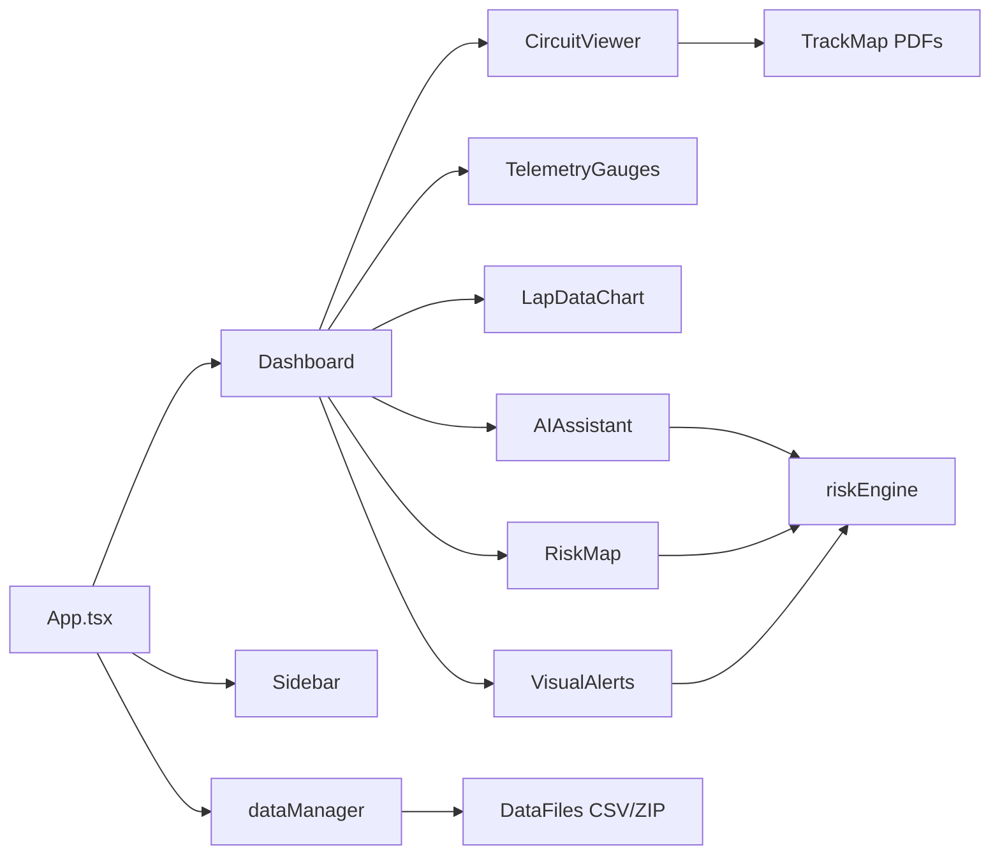

3.2 Diagrama de clases (dominio de telemetría)
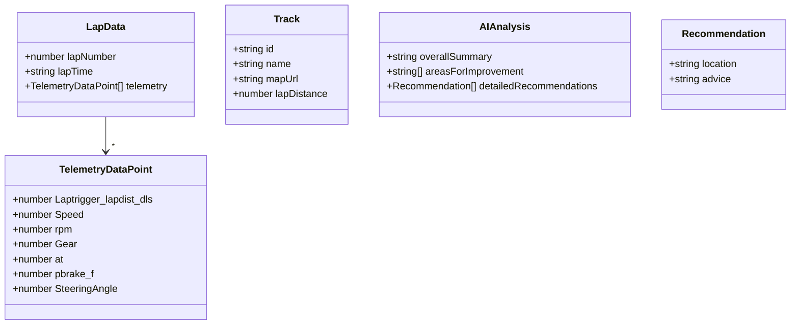

3.3 Diagrama de clases (BD lógica para sesiones)
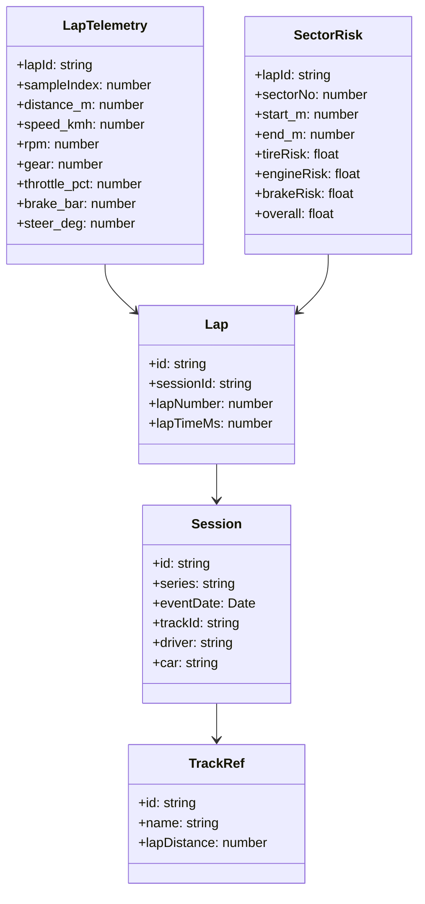

3.4 Diagrama de secuencia (flujo de análisis)
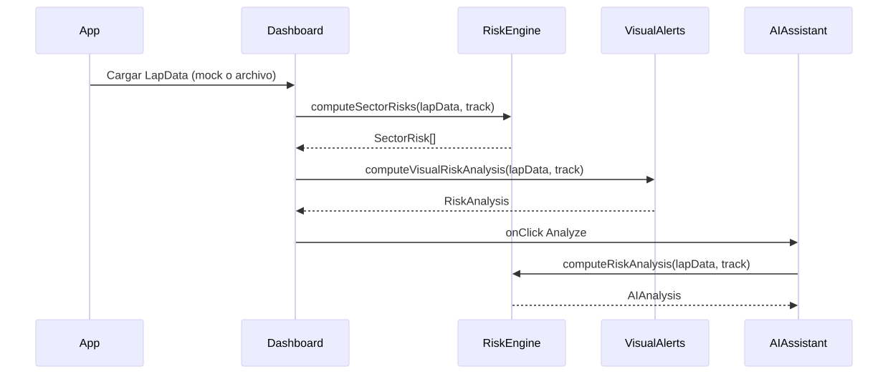
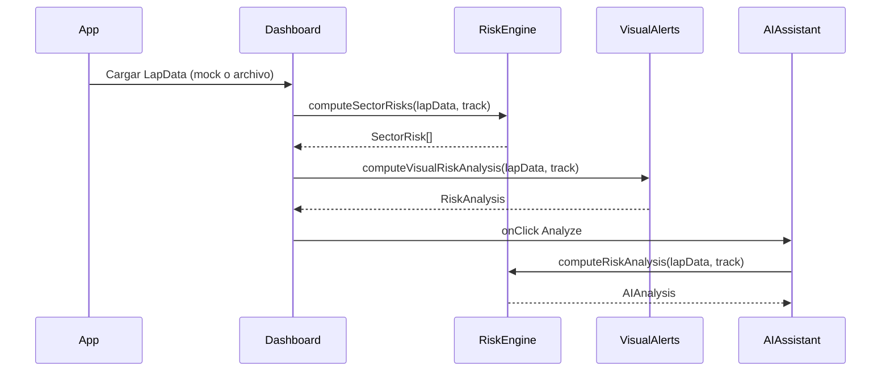

3.5 Diagrama de flujo de datos (end-to-end)

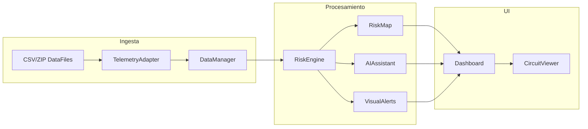

3.6 Diagrama ER (modelo de datos)

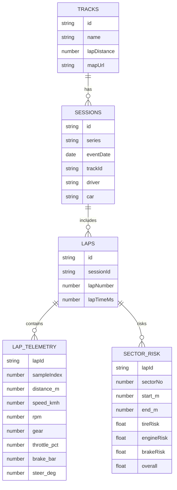

3.7 Diagrama de secuencia del pipeline

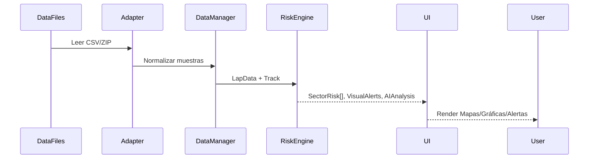

4. Motor de riesgos (fórmulas y supuestos)
- Sectorización: `numSectors = 12`; longitud de sector `lapDistance / 12`.
- Suavizado: medias móviles sobre velocidad, RPM, freno y ángulo de dirección para reducir ruido.
- Proxy de riesgo de llanta: `(avgSpeed/280)*(avgSteer/45) + (avgBrake/80)*0.4`.
- Proxy de riesgo de motor: `(avgRpm/8500)*0.9 + (avgSpeed/300)*0.1`.
- Proxy de riesgo de freno: `(avgBrake/80)*0.8 + (avgSteer/45)*0.2`.
- Riesgo global por sector: `0.45*tire + 0.3*engine + 0.25*brake` y luego `clamp01`.
- Visual Alerts: estimación de `engine.temp` y `fuel.level` basada en últimos valores; umbrales muestran panel y recomendaciones.
- Nota: estos cálculos son demostrativos y deben calibrarse con datos reales por circuito.

5. Integración con IA
- Estructura de salida estricta: `AIAnalysis` (resumen, áreas, recomendaciones por localización).
- Entradas: `LapData` y `Track`.
- Entrenamiento/afinación: usar datasets locales (`DataFiles/`) en tu PC, sin subirlos. La IA debe aprender correlaciones entre perfiles de pista y señales del vehículo.
- Buenas prácticas: normalización por pista, detección de outliers por sensor, partición por sesiones/vueltas.

6. Gestión de datos y rendimiento
- Base de datos local: trata `DataFiles/` y `TrackMap/` como almacenamiento de solo lectura durante desarrollo. No se versionan.
- Lectura incremental: procesa CSV por bloques para evitar cargas de 18GB en memoria.
- Estructuras: almacenar `LapTelemetry` en formato columnar (Parquet) o CSV indexado por `lapId` si se añade backend.
- Identificadores: `sessionId`, `lapId`, `trackId` consistentes.

7. Interfaz y mapas
- `CircuitViewer`: anima el progreso con `offsetPath` sobre rutas simplificadas y embebe el PDF desde `track.mapUrl`.
- `RiskMap`: muestra mapa (PDF o imagen) y barra de riesgos por sector.
- Fallback: si el navegador no renderiza PDFs, abrir `track.mapUrl` en pestaña nueva.

8. Añadir nuevas pistas
- Copia el PDF/imagen a `TrackMap/`.
- Añade entrada en `TRACKS` con `id`, `name`, `mapUrl`, `lapDistance`.
- Opcional: agrega el `PATHS[id]` en `CircuitViewer` para la animación.

9. Ejecución
- `npm install`
- `npm run dev` → `http://localhost:5173/`
- `npm run build` y `npm run preview`

10. Licencia y créditos
- Licencia MIT en `raceTelemetryAi/LICENSE`.
- Referencias oficiales de pistas y proveedores en `README.md`.

11. Reglas de versionado
- Añadir a `.gitignore`: `DataFiles/`, archivos `.zip` de datos y backups grandes.
- No subir `DataFiles/` ni `TrackMap/` si superan límites; usar enlaces o instrucciones de descarga.

12. Cómo visualizar los diagramas en Markdown
- GitHub: abre este archivo en GitHub; los bloques ```mermaid renderizan automáticamente.
- VS Code: instala la extensión “Markdown Preview Mermaid Support” o “Markdown Preview Enhanced”, abre el archivo y pulsa `Ctrl+Shift+V`.
- HTML/CLI: si prefieres imágenes estáticas, usa `@mermaid-js/mermaid-cli` para exportar a PNG/SVG:
  - `npm i -D @mermaid-js/mermaid-cli`
  - `npx mmdc -i raceTelemetryAi/MASTERDOC.md -o masterdoc-diagrams.png` (para bloques individuales, usa archivos `.mmd`).

13. Plan del proyecto y resultados esperados
- Entregables principales:
  - Aplicación web operativa con visualización de telemetría, mapas y análisis de riesgo.
  - Motor de IA predictiva calibrado por pista con recomendaciones por sector.
  - Documentación técnica completa (este MASTERDOC) y README con referencias oficiales.
- Hitos:
  - H1: Consolidar ingestión y mock de telemetría (listo).
  - H2: Calibración por pista con datos reales de `DataFiles/` (perfiles y thresholds).
  - H3: Ajustes UI (fallback PDF, performance, accesibilidad).
  - H4: Exportables (PDF de reportes por sesión, dashboards).
  - H5: Validación cruzada con sesiones reales y métricas de precisión del riesgo.
- Resultados esperados:
  - Tiempos de render en tiempo real (<16ms por frame) y análisis por sector (<250ms por vuelta).
  - Recomendaciones consistentes con variables físicas (velocidad, RPM, freno, dirección) y perfiles de pista.
  - IA entregando “áreas de mejora” accionables y “pit window” coherente con estados de combustible y desgaste.

14. Funcionamiento de la IA (pipeline)
- Ingesta: `LapData` + `Track` → normalización por pista.
- Feature engineering: medias móviles, gradientes (decel/accel), picos de freno, desviación de ángulo.
- Heurísticas iniciales: fórmulas en `riskEngine.ts` (demostrativas, calibrables).
- Entrenamiento/fine-tuning (opcional): usar `DataFiles/` locales para ajustar coeficientes por pista; partición por sesiones/vueltas.
- Inferencia: al pulsar “Analyze Lap”, se computa `AIAnalysis` con resumen, áreas y recomendaciones.
- Monitorización: métricas de desvío entre riesgo estimado y eventos reales (off-track, lock-up, overheating) cuando estén disponibles.

15. Mapa de código (trazabilidad)
- `types.ts`: contratos de datos (TelemetryDataPoint, LapData, Track, AIAnalysis).
- `constants.tsx`: catálogo de pistas y rutas a mapas PDF.
- `services/riskEngine.ts`: sectorización, riesgos, visual alerts y análisis IA.
- `services/dataManager.ts`: perfiles y generador de telemetría para demos.
- `services/geminiService.ts`: esquema/prompt para análisis IA.
- `components/*`: UI modular (Dashboard, CircuitViewer, RiskMap, AIAssistant, VisualAlerts, etc.).
- `TrackMap/*`: mapas PDF locales servidos por Vite.
- `DataFiles/*`: datasets reales para entrenamiento/calibración local.